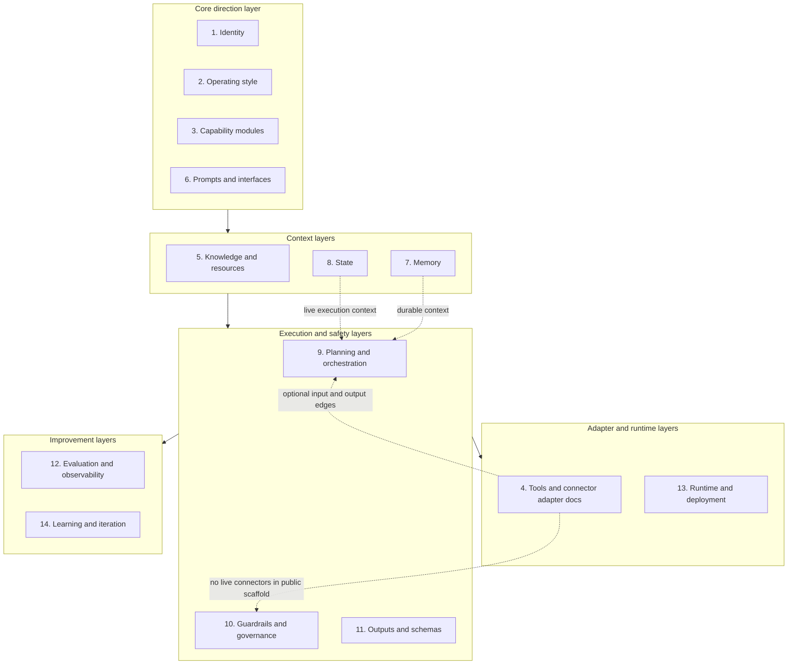

# Artifact Map

## Purpose

This map shows how the public Strategic Mirror Agent scaffold relates to the
stable 14-bucket agent artifact taxonomy. It is a documentation view of the
repo layout, not a runtime inventory. The public repo contains scaffold files,
templates, policies, schemas, synthetic examples, and validation scripts only.

Private workplace memory, live state, connector credentials, raw traces, local
environment values, private connector configs, and real workplace content stay
outside this repo.

## Visual Map

## Taxonomy Table

| Bucket | Purpose in this repo | Primary files or folders | Lifecycle posture | Public/private safety note |
| --- | --- | --- | --- | --- |
| 1. Identity | Defines the agent's role, responsibilities, and public operating contract. | `agent/AGENT.md`, `agent/direction/identity.md`, `agent/agent.yaml` | Design-time scaffold | Public-safe identity only. Do not add real employer, team, manager, peer, client, or workplace details. |
| 2. Operating style | Defines methodology, voice, reasoning posture, and how the agent should communicate. | `agent/direction/methodology.md`, `agent/direction/voice.md` | Design-time scaffold | Keep generic and reusable. Do not encode private relationship history or workplace-specific tone rules. |
| 3. Capability modules | Provides task-oriented prompt modules for drafting, sequencing, positioning, and related work. | `agent/prompts/tasks/` | Design-time scaffold | Use synthetic or generic examples only. Do not include real workplace messages. |
| 4. Tools | Documents connector policy, registry shape, protocol notes, and host adapter expectations. | `agent/connectors/`, `docs/connector-strategy.md`, `examples/connectors/` | Adapter layer | Connectors are optional edge artifacts. This public scaffold does not implement live connectors or store credentials. |
| 5. Knowledge and resources | Provides a place for reusable reference material that is not personal memory. | `agent/knowledge/` | Runtime template | Public entries must stay generic or synthetic. Private reference material belongs in a private instance. |
| 6. Prompts and interfaces | Defines invocation surfaces, task prompts, and host-facing interface guidance. | `agent/prompts/`, `agent/interfaces/` | Design-time scaffold | Prompts may describe workflows, but must not include private user context or real communications. |
| 7. Memory | Provides durable context templates for slowly changing facts, preferences, goals, and recurring patterns. | `agent/memory/`, `docs/memory-vs-state.md` | Runtime template | Templates are public. Filled private memory stores must not be committed to this repo. |
| 8. State | Provides templates for fast-changing execution context, open decisions, deadlines, and active situations. | `agent/state/`, `docs/memory-vs-state.md` | Runtime template | Templates are public. Live state from active situations must stay private. |
| 9. Planning and orchestration | Defines workflow, handoff, continuation, and session-loop behavior. | `agent/workflow/`, `docs/architecture.md` | Design-time scaffold | Planning logic can be public when generic. Do not include live plans that reveal private workplace activity. |
| 10. Guardrails and governance | Defines confidentiality, approval, claims, wellbeing, and connector safety boundaries. | `agent/guardrails/`, `docs/public-safety.md` | Design-time scaffold | Public guardrails should protect against leaking private content and unsafe connector behavior. |
| 11. Outputs and schemas | Defines response templates, output folders, JSON schemas, and schema examples. | `agent/templates/`, `agent/outputs/`, `schemas/`, `examples/` | Design-time scaffold and validation artifact | Schemas and synthetic examples are public-safe. Real outputs, drafts, and messages belong in a private instance. |
| 12. Evaluation and observability | Provides eval cases, rubric, and observability scaffolding without storing private traces. | `evals/`, `observability/` | Evaluation artifact | Use synthetic evals only. Do not commit raw traces or logs from private runtime use. |
| 13. Runtime and deployment | Documents runtime posture and public-safe deployment placeholders. | `agent/runtime/`, `docs/private-instance-guide.md` | Runtime template | The public repo is not a hosted private runtime and must not contain local environment values or secrets. |
| 14. Learning and iteration | Tracks scaffold changes, maintenance notes, and future improvement loops. | `agent/iteration/`, `CHANGELOG.md`, `docs/release-notes-v0.1.0.md` | Iteration artifact | Public iteration notes should describe scaffold changes only, not private outcomes or workplace developments. |

## Memory And State

Memory and State are separate layers.

Memory is durable, slowly changing context. It is for material that would still
matter after a live situation ends, such as stable communication preferences,
career goals, durable values, and recurring patterns.

State is fast-changing execution context. It is for material tied to a current
situation, decision, deadline, workflow, risk, or stale-after date.

The public repo includes templates and classification guidance for both layers.
It does not include filled private Memory stores or live State files.

## Connectors As Adapter Layer

Connectors, MCP notes, A2A notes, protocol mappings, and host adapters are
implementation-edge artifacts. They are not part of the agent's core identity.

The core scaffold works from files and manually supplied context. Connector
input, if added in a private runtime, must pass through classification,
reconciliation, workflow, and guardrail review before it affects Memory, State,
Knowledge, or an output. No live connectors are implemented in this public
scaffold.

## Adding New Files

Use this map before adding a new file:

1. Pick the one taxonomy bucket that owns the file's main purpose.
2. Decide whether the file is design-time scaffold, runtime template, adapter
   layer, evaluation artifact, or iteration artifact.
3. Check whether the file is safe for the public repo. If it contains private
   memory, live state, raw traces, connector credentials, local environment
   values, private connector configs, or real workplace content, it belongs
   outside this repo.
4. Keep connectors and protocol notes at the adapter boundary. Do not use them
   to redefine agent identity, Memory, State, or guardrails.
5. If a file mixes Memory and State, split it or clarify which layer owns each
   part before committing it.
